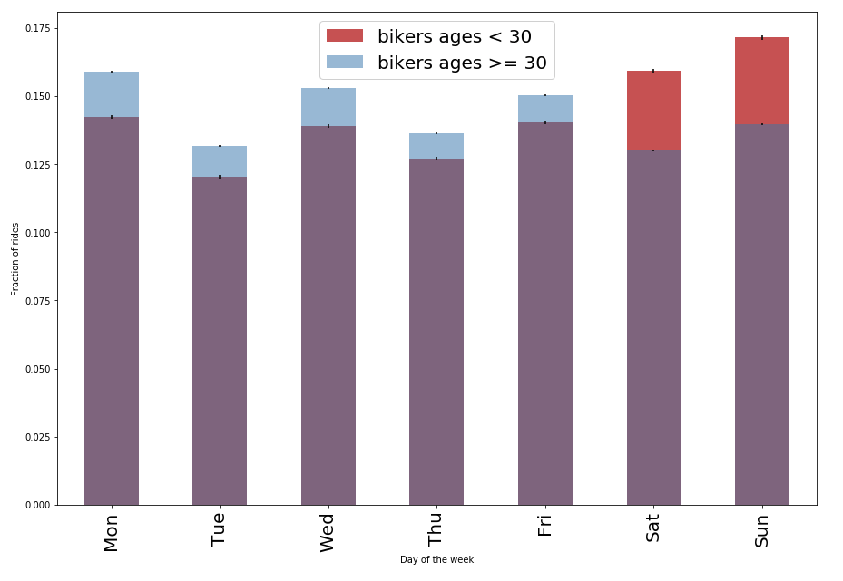

# Contributor
This homework is solely done by Wei-Yun Wang

Caption: As one of the review suggested, I changed the legend description from "older" and "younger" to more description ones. This graph suggests that older people use bike to commute on weekdays more than younger people, but younger people use bike more on the weekend.
