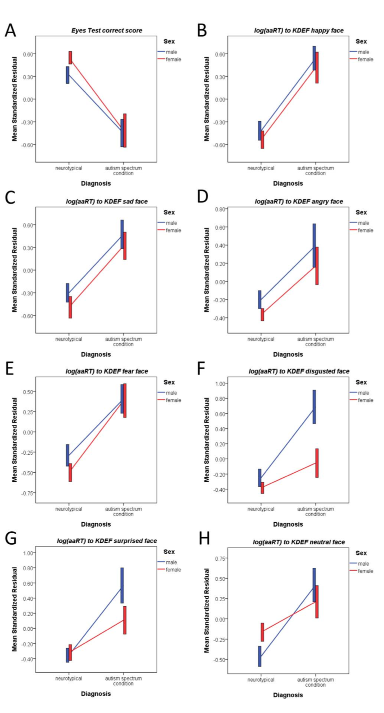
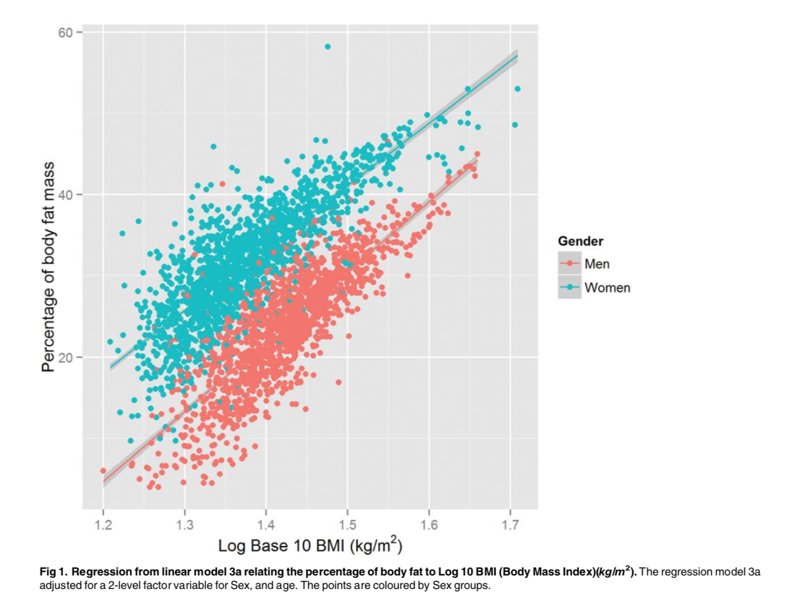
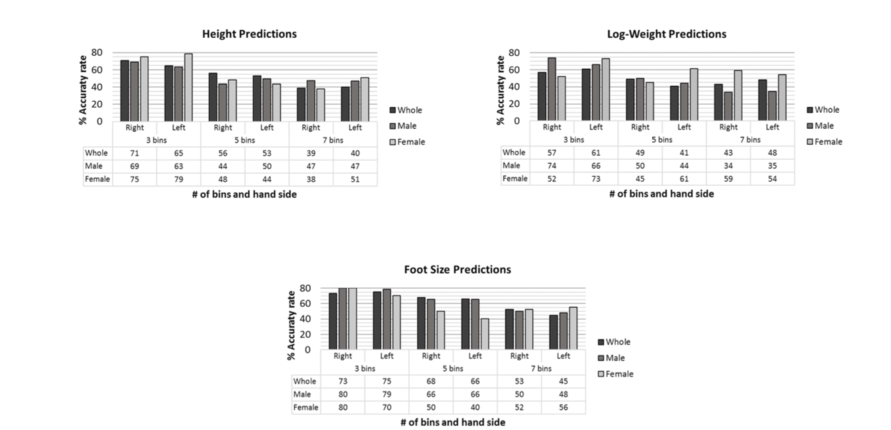

## Contributor
This homework is done solely by Wei-Yun Wang

## Table

| **Statistical Analyses**	|  **IV(s)**  |  **IV type(s)** |  **DV(s)**  |  **DV type(s)**  |  **Control Var** | **Control Var type**  | **Question to be answered** | **_H0_** | **alpha** | **link to paper**| 
|:----------:|:----------|:------------|:-------------|:-------------|:------------|:------------- |:------------------|:----:|:-------:|:-------|
ANCOVA	| 2, sex and diagnosis | categorical | 1, EYES test | numerical | 2, age, FIQ  | continuous | Do males and females who have ASC perform differently? | female ASC groups = male ASC groups | 0.05 | [Cognition in Males and Females with Autism: Similarities and Differences](https://journals.plos.org/plosone/article?id=10.1371/journal.pone.0047198) |
Multiple Regression | 2, BMI, BAI | numerical | 1, body dat | numerical |2, age, sex | continuous, categorical | Can BMI and BAI predict body fat? | beta = 0 | 0.05 |[A Comparison between Multiple Regression Models and CUN-BAE Equation to Predict Body Fat in Adults](https://journals.plos.org/plosone/article?id=10.1371/journal.pone.0122291) |
Logistic Regression | 21, hand features | numerical | 4,sex, height, weight, foot size | categorical; numerical | 0 | None | Can hand feasures predict sex, height, weight, and foot size? | accuracy rate  = 0 | 0.05 | [Comparing Machine Learning Classifiers and Linear/Logistic Regression to Explore the Relationship between Hand Dimensions and Demographic Characteristics](https://journals.plos.org/plosone/article?id=10.1371/journal.pone.0165521) |
|||||||||
	
	

