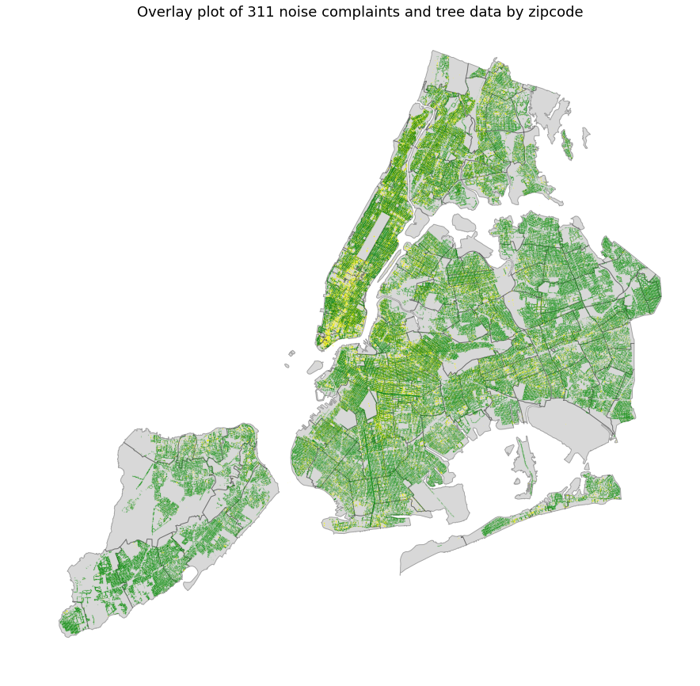
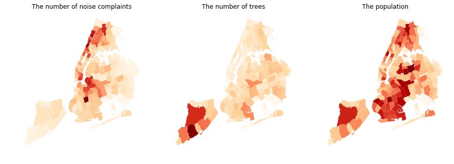

## Review by Wei-Yun Wang (wyw238)

### CLARITY
The graphs are unclear of the meaning of the color, as well as the magnitude the color represents. There is no legend to indicate such information.
### ESTHETIC
The plot is beautiful and intuitive. I ran a color blind test, and all graphs convey information consistently and clearly regardless of the color-blind symptom.
### HONESTY
Since I can't see the legends of the graphs, I can't determine if the graphs are manipulated. Without the legend showing how different color represents different groups, the plots are subject to dishonesty.
