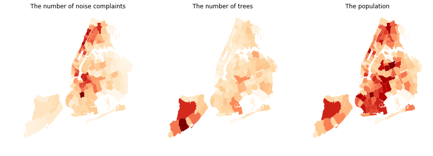

## Review by Wei-Yun Wang (wyw238)

### CLARITY
The graphes are unclear of the meaning of the color, as well as magnitude the color represents. There is no legend to indicate such information.
### ESTHETIC
The plot is beatuiful and intuitive. I ran a color blind test and all graphes convey information consistently and clearly regardless of color blind symton.
### HONESTY
Since I can't see the legends of the graphes, I can't determine if the graphes are manipulated. Without the legend showing how different color reoresents different groups, the plots are subject to dishonesty.
